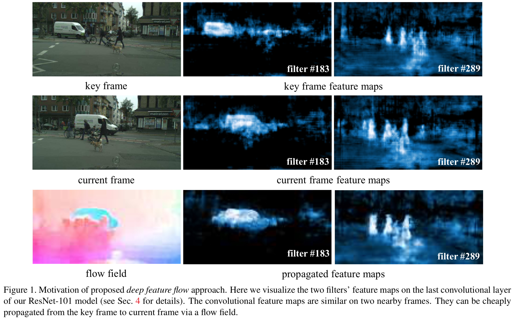
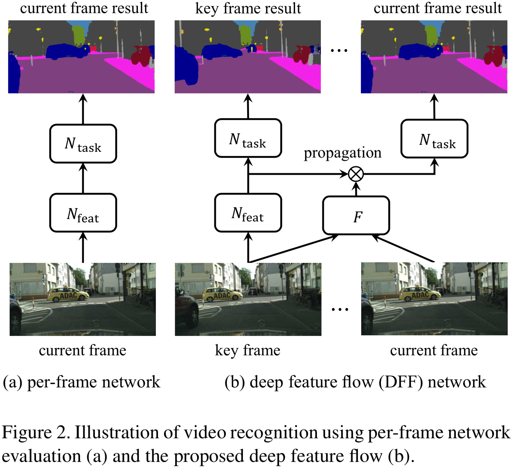
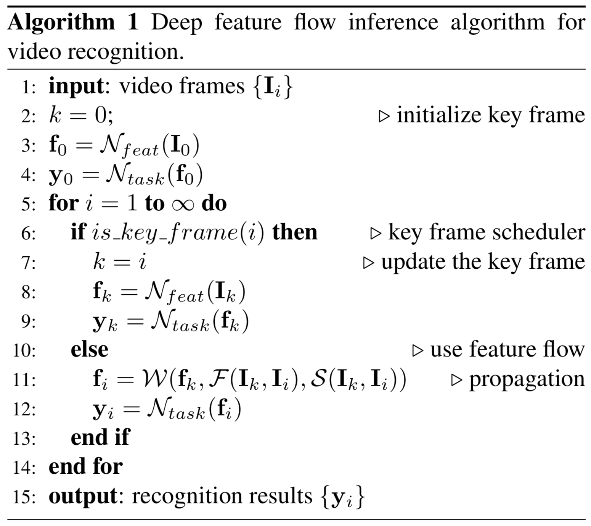

[painterdrown Blog](https://painterdrown.github.io) - [painterdrown CV](https://painterdrown.github.io/cv)

# Deep Feature Flow for Video Recognition 学习笔记

> ⏰ 2018-06-01 00:00:00 
> 👨🏻‍💻 painterdrown

@[toc]

Oh yeah, 终于开始看视频目标检测啦！BTW，🎈 *Happy Children's Day* 🎈

## 0. Abstract

目前的图像目标检测已经发展地比较成熟了，不过如果单帧地应用在视频上则显得太慢了。作者提出了 deep feature flow（深度特征流，一个又快又准的视频目标检测框架。它只在 sparse key frames 上跑卷积，通过 deep feature maps 在同一个流场（我理解为一段连续的且比较相似的帧）的其它帧之间进行传播。训练是端到端的，速度和精度（精度有吗？感觉还不如 Faster R-CNN）上都有明显的提升。

## 1. Introduction

从图像识别到视频识别，要处理好视频帧之间的连续性以及冗余的信息。现在大多数的 CNN 架构里面，卷积计算占计算资源消耗的主体。计算出来的 convolutional feature maps 保留了图像的低级内容到中高级语义内容的对应关系。这样一来，就可以轻易地在相邻帧之间传播特征信息（by spatial warping 空间变形），这与光流类似。

一般来说，flow estimation & feature propagation 比简单地去计算多帧的 convolutional features 要快得多。而且如果能用网络做 flow estimation 的话，整个视频目标检测架构就是端到端的。

## 2. Related Work

+ **Image Recognition**。已经有很多成熟的网络了，可以看我前面图像目标识别的学习笔记，这里不赘述。

+ **Network Acceleration**。比如 Fast R-CNN 里面的矩阵分解；比如 [Quantized Neural Networks](../papers/Quantized_Neural_Networks.pdf) 的参数量子化（暂未了解）。

+ **Optical Flow（光流）**。这个我之前在研究生学习班里几次听到这个概念。它是视频分析的基本任务，目前主要关注的是 small displacements，最近逐渐转向 large displacements，以及加入 combinatorial matching（组合匹配）这个概念。现在的深度学习已经逐渐漫延到光流这一块，[FlowNet](../papers/FlowNet.pdf) 用深层 CNN 来估算视频中的 motion 并且有不错的效果。总而言之，光流在计算机视觉方面有奇效，比如 pose estimation（姿态估计），应该探索如何应用于视频目标检测中。

+ **Exploiting Temporal Information in Video Recognition**。这里要解决的问题是，如何挖掘视频中的时间信息？在 [T-CNN](../papers/T-CNN.pdf) 里面，其融合了时间和上下文信息；[FSO](../papers/FSO.pdf) 提出了大范围的时空正则化；[STFCN](../papers/STFCN.pdf) 用一个时空的 FCN 来做视频语义分割。虽然这些方法提升了精度，但是还是需要大量的计算，影响了速度。

+ **Slow Feature Analysis**。在视频里面，高级的语义概念往往比低级的图像外观演化得更慢，因此这些深度的特征在视频帧之间的变化十分平滑。

+ **[Clockwork Convnets](../papers/Clockwork_Convnets.pdf)**。它做的事情跟 Deep Feature Flow 很类似：都是使网络中的某些层在视频中的某些帧上失效以及特征复用。但是由于没有考虑到不同帧之间的对应信息，Clockwork Convnets 在加速的时候会损失较多的精度。

## 3. Deep Feature Flow

### 3.1. Inference

总网络（feed-forward convolutional neutral）可以分解为连续的两部分：**N~feat~（特征网络）** 和 **N~task~（任务网络）**。前者（全卷积）会输出许多 feature maps，后者会在这些 feature maps 上面做检测任务。

通过流估计算法得到 flow field（我理解为关键帧及其相邻帧之间的流信息）。通过双线性插值来做 feature warping。为了减少流估计算法带来的误差，通过 “scale field” 来做更好的特征估计。

伪代码如下：

### 3.2. Training

Flow function 本来是用来获取低级的图像信息的，不适用于高级 feature maps 的提取。作者用一个 CNN 去估算 flow fiel 和 scale field。因此，就可以进行端到端的训练。

训练的方法是 **SGD（随机梯度下降）**。在每一个 mini-batch 里面，随机地到连续的 10 帧里面随机抽取两帧 I~k~（关键帧） 和 I~i~。前面说到的 **N~feat~** 跑在 I~k~ 上，然后 **flow network N~flow~** 跑在 I~k~ 和 I~i~ 上来算出 flow field 和 scale field。N~flow~ 的速度要比 N~feat~ 快很多，前者是在 *Flying Chairs dataset* 上预训练的。在 N~flow~ 最后输出层加上一个 sibling：scale function。

值得一提的是，视频检测的训练集标注的代价很高（特别是对于采用 per-frame 做法的网络）。但是 DFF 则不同，它只要求 I~i~ 帧的数据集有标准就足够了。

### 3.3. Inference Complexity Analysis

这一段主要是在分析 inference 的复杂度，inference 可以理解为用训练出来的模型去 test。分析的过程参考原论文吧。

### 3.4. Key Frame Scheduling

这篇论文用的方法是固定长度地选取一个关键帧。但是作者提到，最理想的做法是将发生剧烈变化的帧作为关键帧。

## 4. Network Architectures

### 4.1. Flow Network

这里用的是 [FlowNet](../papers/FlowNet.pdf) 的简单版本：将每一层卷积核的数目减少一半，这样整个网络的复杂度就变为原来的四分之一。再者，加入 *FlowNet Inception* 并且将其复杂度降低为 FlowNet 的八分之一。

### 4.2. Feature Network

这里用的是在 ImageNet 上预训练的 **ResNet-50** 和 **ResNet-101**（取消了最后的 1000-way 分类层）。为了生成更稠密的 feature maps，将其步长从 32 减小到 16。后面：

+ 如果做语义切割，则用 **DeepLab**；
+ 如果做目标检测，则用 **R-FCN**。

### 4.3. Semantic Segmentation

暂时对这里没兴趣。

### 4.4. Object Detection

> 参考 [R-FCN 学习笔记](https://painterdrown.github.io/cv/rfcn)，这里不做赘述。

## 5. Future Work

由于要研究视频目标检测这一块，所以有必要了解一下这个话题。

> 1. How the joint learning affects the flow quality?

作者目前无法对此进行估算，因为缺少 ground truth（真实数据）。目前传统的光流技术受限于人造的或者小的数据集，对于深度学习来说数据还是很稀缺的。

> 2. How to benefit from improvements in flow estimation and key frame scheduling?

关键帧的选择会较大地影响后面的检测效果。作者前面提到，这篇论文是定长地选取关键帧。然而最佳的做法是选取变化最大的帧作为关键帧，目前来说这可能会消耗过多的计算资源，希望在将来能在将这个 task 放在网络中来做。

## 6. Resources

+ [Deep Feature Flow for Video Recognition](../papers/DFF.pdf)
+ [GitHub (python)](https://github.com/msracver/Deep-Feature-Flow)
