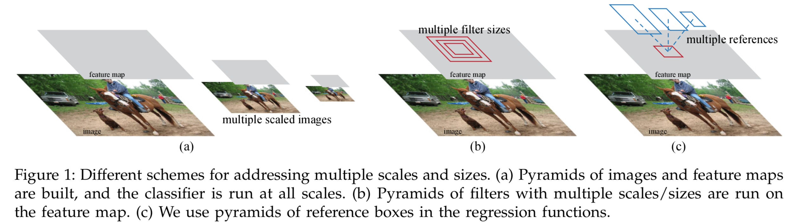
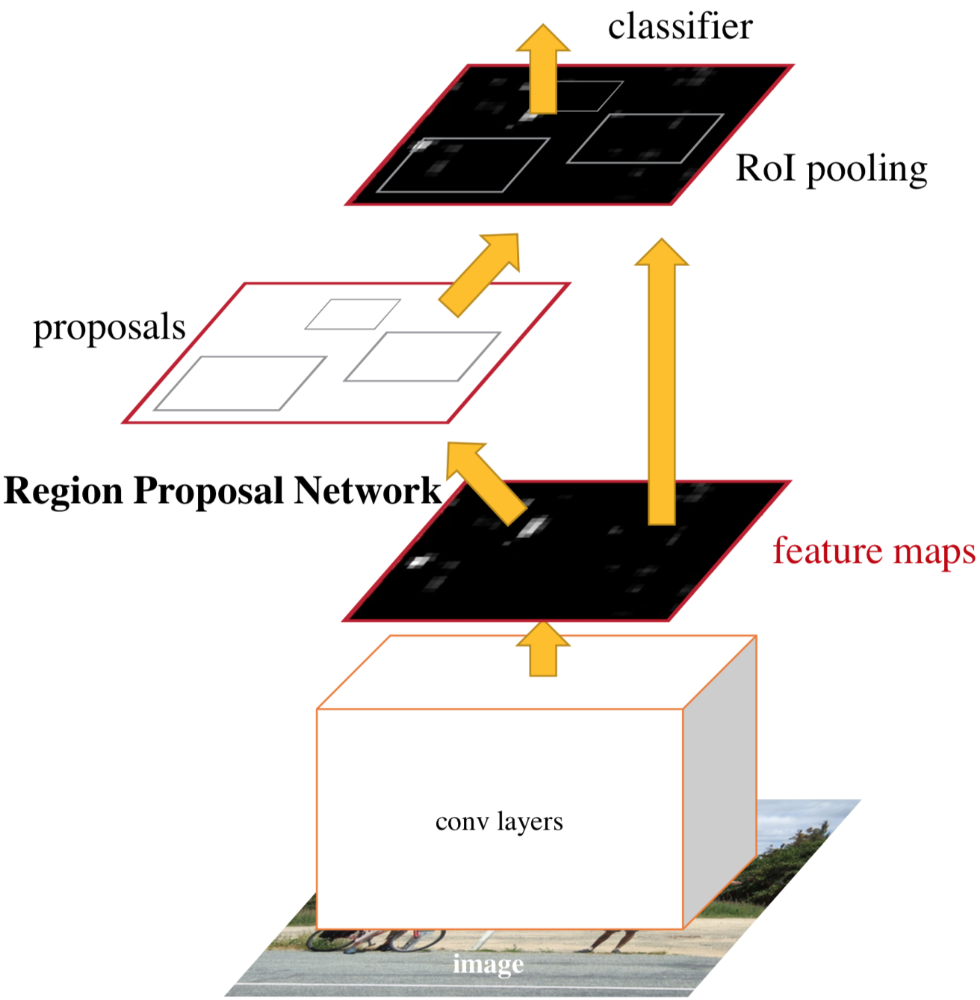
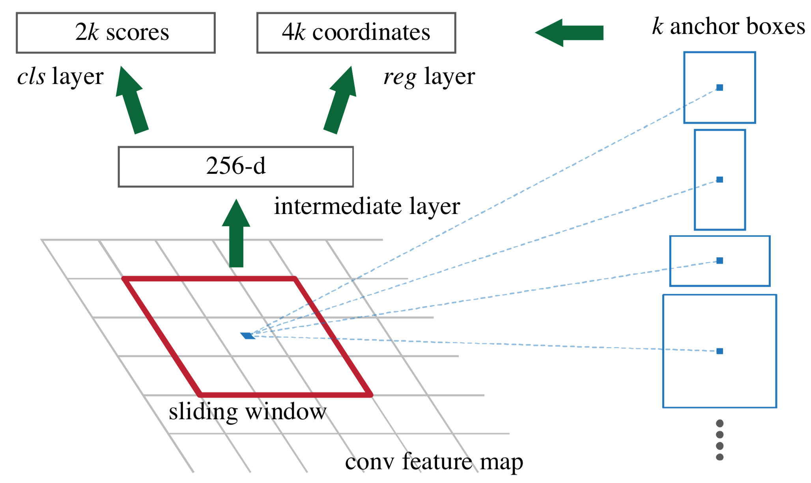
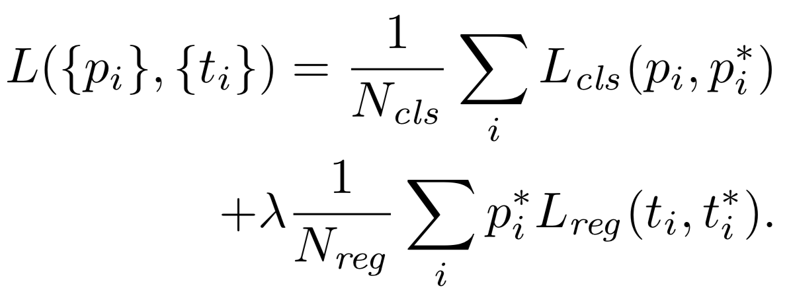

[painterdrown Blog](https://painterdrown.github.io) - [painterdrown CV](https://painterdrown.github.io/cv)

# Faster R-CNN 学习笔记

> ⏰ 2018-05-30 15:50:27 
> 👨🏻‍💻 painterdrown

[TOC]

最近要准看视频目标检测里面的 R-FCN，听小伙伴说涉及了很多 Faster R-CNN 的内容，之前看 Faster R-CNN 的时候赶时间没做笔记，现在补回来。

## 0. Abstract

目前最前沿的目标检测神经网络模型，都是依赖于 region proposal algorithms（区域建议算法）来假定图像中目标的位置。在检测方面，Fast R-CNN 在速度上已经做得挺不错了，现在主要的瓶颈在于 region proposal 的计算上。就目标检测来说，之前的做法都不是端到端的，因为要先计算出 region proposal，再把它扔到网络中去进行检测。

因此，这篇论文介绍了 Region Proposal Network (RPN) ，这个网络将用于计算 region proposal，而且可以与后面的 detection network 共享 convolutional features。也就是说，我们现在可以把这两部分工作给结合起来：RPN 先算出图片中目标的位置以及对应的置信度，再将这部分信息传递给 Fast R-CNN 网络进行检测。所以我们可以这里理解：`Faster R-CNN = RPN + Fast R-CNN`。Faster R-CNN 通过 "attention" 将两者合并为一个单一的端到端的目标检测网络。

## 1. Introduction

现在很多 region proposal algorithms 都是用的 [Selective Search](../papers/Selective_Search.pdf)，效果上比较不理想。而且是跑在 CPU 上的，如果只是单单将其重构为 GPU 版本，也没有办法跟接下来的检测网络分享计算结果。

Faster R-CNN 使用深度卷积网络来计算 region proposals，可以说是最大的一个亮点。作者观察到，Fast R-CNN 检测网络用到的 convolutional feature maps，也可以用于生成 region proposals。在 RPN 的 convolutional features 之上，作者加了一层卷积来同时做边界回归和目标置信度计算，这使得 RPN 成为全卷积网络 (FCN)，可以端到端地生成 region proposals。

上面介绍了三种选择 egion proposals 的策略，Faster R-CNN 采用的是第三种，称为“锚点”。

训练的 Faster R-CNN 的策略：固定某个 proposals，交替地进行 region proposal 的调优以及 object detection 的调优。这种训练方法能够快速收敛，并且产生一个共享的带有 convolutional features 的统一网络。

## 2. Faster R-CNN

### 2.1. Region Proposal Networks

由于要和 Fast R-CNN 共享计算，作者假设这两部分网络都共享一系列相同的卷积层。RPN 最后一个 shared convolutional layer 会输出可分享的 convolutional feature map，然后在它上面 "slide a small network" 来生成 region proposals。这个滑动的小网络层的输入是 n×n×d（作者取 n = 3，而 d 取决于 convolutional feature map 的通道数），然后这个输入会被映射为低维特征。这些低维的特征将被输送给两个兄弟全连阶层：

+ box-regression layer (reg)
+ box-classification layer (cls)

#### 2.1.1 Anchors

对于每一个 sliding-window，我们都会选择几个 region proposals（最多 k 个）。因此 reg 层输出的参数最多为 4k，cls 输出的参数最多为 2k（有目标的概率和无目标的概率，其实看成只有 1k 个参数也没毛病，因为两者加起来为 1）。这 k 组 proposals 是由一个 anchor（锚点）通过不同的参数 (scale & aspect ratio) 来确定的。其中，

+ **scale** 是 proposals 的尺寸（应该可以理解为面积），也就是 width×height
+ **aspect ratio** 是 proposals 的长宽比，也就是 width:height

关于锚点，作者高亮了两点：

+ **Translation-Invariant Anchors** 。图像的转换对于锚点及其 proposals 计算函数来说，是具有不变形的（这一点我暂无深入的理解）。
+ **Multi-Scale Anchors as Regression References**。意思是 Faster R-CNN 的锚点是基于 "a pyramid of anchors"，这种选 proposals 的策略比较高效，因为全程只用计算输入图像一个 scale 下的 convolutional features 就好。

#### 2.1.2 Loss Function

在训练 RPN 的时候，将满足下面两个条件其中之一的样本标记为正：

1. anchors with the highest Intersection-over-Union (**IoU**) overlap with a **ground-truth box**
2. an anchor that has an IoU overlap higher than 0.7 with any ground-truth box

其中，ground-truth box 是指训练集中预标注好的有目标的框。

这里沿用了 Fast R-CNN 的损失函数：

这个损失函数同时考虑了 reg 和 cls 两个任务。

#### 2.1.3 Training RPNs

RPN 的训练是端到端的，通过**反向传播**和**随机梯度下降**。

+ 梯度下降的时候，一个 mini-batch 中的所有样本取自同一张图片
+ 每一张图片随机地采样 256 个 anchors（正负样本比例控制为 1:1）
+ 新层的参数采用 0 均值，0.01 标准差下高斯分布的随机初始化
+ 其他层用 ImageNet Classsification 预训练出来的模型进行初始化
+ 前 60k mini-batches 的学习率为 0.001，后 20k mini-batches 的学习率为 0.0001
+ 0.9 momentum, 0.0005 weight decay

### 2.2. Sharing Features for RPN and Fast R-CNN

一开始，RPN 和 Fast R-CNN 是独立进行训练的，会以不同的方式各自修改他们的卷积层。要使他们能够共享卷积，有三个关键：

1. **Alternating training（交替训练）**。首先先将 RPN 训练出来，得出 proposals 后去训练 Fast R-CNN，然后再用 Fast R-CNN 调优出来的网络去初始化 RPN，不断迭代这个过程。

2. **Approximate joint training（近似联合训练）**。在做前向的时候，将 RPN 得出来的 proposals 认为是 fixed, pre-computed 的，然后传给 Fast R-CNN。反向传播的时候，（两个网络的）共享层会同时受到 RPN loss 和 Fast R-CNN loss 的影响。由于忽略了 proposal boxes’ coordinates 的微分，所以说是近似的。

3. **Non-approximate joint training（非最大化联合训练）**。虽然 Approximate joint training 忽略了 predicted bounding boxes 坐标的梯度，但是在 RoI 池化层我们需要保证 predicted bounding boxes 的坐标是可微的，这个可以通过 “RoI warping” 层解决（超纲不解释 hhh）。

总结起来，有以下四步（感觉没必要翻译）：

1. We train the RPN initialized with an ImageNet-pre-trained model and fine-tuned end-to-end for the region proposal task.

2. We train a separate detection network by Fast R-CNN (also initialized by the ImageNet-pre-trained model) using the proposals generated by the step-1 RPN.

3. We use the detector network to initialize RPN training, but we fix the shared convolutional layers and only fine-tune the layers unique to RPN.

4. We fine-tune the unique layers of Fast R-CNN, keeping the shared convolutional layers fixed.

### 2.3. Implementation Details

实现细节就自行看论文啦，不作赘述。

## 3. Resources

+ [Faster R-CNN: Towards Real-Time Object Detection with Region Proposal Networks](../papers/Faster_R-CNN.pdf)
+ [GitHub (MATLAB)](https://github.com/shaoqingren/faster_rcnn)
+ [GitHub (python)](https://github.com/rbgirshick/py-faster-rcnn)
