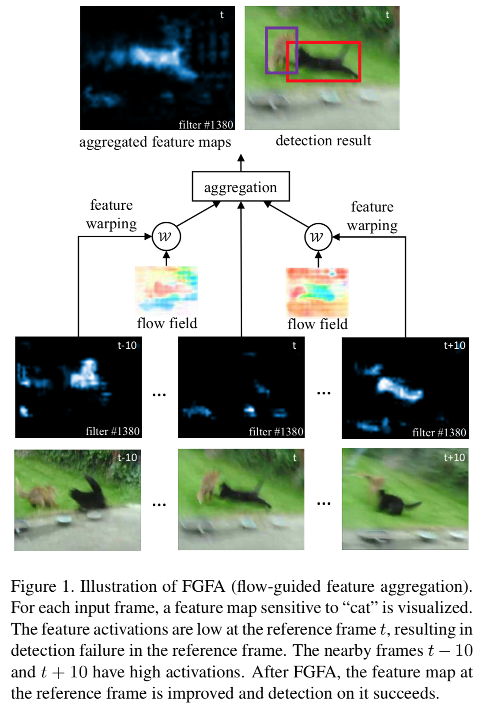

[painterdrown Blog](https://painterdrown.github.io) - [painterdrown CV](https://painterdrown.github.io/cv)

# Flow-Guided Feature Aggregation for Video Object Detection 学习笔记

> ⏰ 2018-06-02 09:40:36 
> 👨🏻‍💻 painterdrown

@[toc]

## 0. Abstract

目前的视频目标检测网络都不是端到端的，作者提出了一个叫 flow-guided feature aggregation（流导向特征聚集），一个端到端的深度学习框架，加下来我简称为 **FGFA**。

> It leverages temporal coherence on feature level instead.

这句话的意思是说，FFA 关注如何利用 feature level 的时间连贯性信息，并且利用这些信息来达到好的检测效果。

FFA 聚集了同一运动路径 (motion path) 上的特征信息。

## 1. Introduction

目前最帅的图像目标检测框架基本都是 **Deep Convolutional Neural Networks**，但是它在视频帧中表现欠佳——原因是视频帧中 *motion blur*（图像运动的区域容易模糊） 的现象比较明显，还有 *video defocus*，*rare poses* 等原因。

> The performance improvement is from heuristic post-processing instead of principled learning.

目前的视频检测框架也是 *box level* 的：在检测出关键帧之后，后续的 bounding box 检测是比较传统粗暴的（基于 motion estimation 或者 optical flow）。这种做法效果往往很平庸。

但是，一些比较差的 feature aggregation 做法会受 *video motion* 的影响（同一个目标在相邻帧之间空间不对齐），所以我们应该研究如何在深度学习中模型化这些 motion。

FGFA 涉及了四个网络：

+  **feature extraction network**。用来提取 reference frame（可以理解为当前帧）的特征。

+ **optical flow network**。用来估计邻近帧之间的运动信息。然后基于 reference frame，根据这个运动信息，对邻近帧做 warping（变形）。

+ **adaptive weighting network**。用来在 reference frame 的 feature maps 上面聚集变形后的邻近帧的 feature maps。

+ **detection network**。聚集后的 feature maps 会输入到该网络，来检测 reference frame 上的目标。

另外，FGFA 是 feature level 的，若是与一些 box level 的方法结合互补，可以提升效果。

## 2. Related Work

+ **Object detection from image**。这里提到了 R-FCN，其他不作赘述。

+ **Object detection in video**。ImageNet 有一个新的比赛叫 VID，目前很多方法都是 *bounding-box post-processing* 且 *multi-stage pipeline*（后面的 stage 必须依赖于前面 stage 的结果，而且不好做错误校正）。这正是 box level 的弊端，因此，FGFA 是基于 feature level 的端到端网络。

+ **Motion estimation by flow**。这里讲的东西很多在 [Deep Feature Flow for Video Recognition 学习笔记](https://painterdrown.github.io/cv/dff) 已经提到了，不作赘述。

+ **Feature aggregation**。它在动作识别 (action recognition) 以及视频描述 (video description) 中已经被广泛应用了，大多数都是用 **RNN** 来聚集邻近帧的 feature。此外，也有一些是用卷积来提取比较全面的时空特征 (spatial-temporal features)，但是这些卷积核会阻碍高速移动目标的 modeling。但是如为了打破这个限制而单单增大卷积核的大小的话，则会带来比较多的计算开销、内存问题以及过拟合等问题。因此，FGFA 依靠 flow-guided aggregation（具有可伸缩性）来得到不同类型的目标运动信息。

+ **Visual tracking**。现在基本都用深度 CNN 来做目标追踪。而目标追踪与目标检测又有区别：前者会先假设目标的初始位置，且不要求做分类。

## 3. Flow Guided Feature Aggregation

### 3.1. Model Design

首先，用深层卷积计算出 reference frame I~i~ 的特征，然后通过 [FlowNet](../papers/FlowNet.pdf) **N~flow~** 来推导出其 neighbor frame I~j~ 的特征，紧接着这个特征再做一个 warping。

得到一系列的 warping 后的特征，就拿来做 **feature aggregation**。聚合后的特征包含了如 illuminations/viewpoints/poses/non-rigid 等信息。

特征聚集是通过加权相加得到的，离 reference frame 越近的帧，权重越大。用 **cosine similarity metric** 来衡量变性后特征与 reference frame 的特征之间的相似度。要注意的是，计算相似度不是直接用的 feature，而是把 feature 再经过一个 **tiny fully convolutional network**，目的是将特征投影成一个 new embedding（我也不懂是什么），这样能更方便后面的网络去做相似性计算。

### 3.2. Training and Inference

Inference 的伪代码如下，可以描述为：

1. 首先用 N~feat~ 对视频的每一帧都算出其卷积特征图
2. 依次将每一帧作为 reference frame，通过上述的方法算出其聚集后的特征
3. 将聚集后的特征放进 N~det~ 进行目标检测
4. 更新 **feature buffer**，这里对应伪代码的第 13 行。我思考了一下终于知道这一步的意义：算法一开始的时候，不是直接把所有帧的特征都算出来了，因为那样子太占内存。因此只虚先算前 K 个特征，维护一个长度为 K 的 feature buffer。在每一轮迭代之后，都会计算下一个 feature 塞进 buffer 里面。

整个 FGFA 架构是可导而且端到端的。训练的时候，由于内存的限制，K 只能取一个比较小的值 (K = 2)。值得注意的是，这里有一个 **temporal dropout** 的说法。不是说训练的时候只在前后各两个邻近帧之间采样，采样的范围是跟前面的 inference 的范围一样，只是训练的时候只前后各采样 2 帧，所以这里要理解好 K = 2 的含义。

### 3.3. Network Architecture

+ **Flow network**: FlowNet (“simple” version)
+ **Feature network**: ResNet (-50 and -101) and Inception-Resnet
+ **Embedding network**: 3 layers (randomly initialized):
  + 1×1×512 convolution
  + 3×3×512 convolution
  + 1×1×2048 convolution
+ **Detection network**: R-FCN

## 4. Experiments

参考以下两篇论文，训练的时候要用到 ImageNet DET 和 VID 两个数据集。

> [T-cnn: Tubelets with convolutional neural networks for object detection from videos.](../papers/T-CNN.pdf) 
> [Multi-Class Multi-Object Tracking using Changing Point Detection](../papers/Multi-Class_Multi-Object_Tracking_using_Changing_Point_Detection.pdf)

训练分两个阶段：
  1. 使用 DET 数据集来训练 N~feat 和 N~det~（使用的标注数据是 VID 中的 30 个分类），相关细节：
    + 使用了 SGD (one image at each mini-batch)
    + 使用 4 个 GPU 来跑 120K 次迭代 (each GPU holding one mini-batch)
    + The learning rates are 10^−3^ and 10^−4^ in the first 80K and in the last 40K iterations
  2. 使用 VID 数据集来训练整个 FGFA 模型，相关细节：
    + 使用 4 个 GPU 来跑 60K 次迭代
    + The learning rates are 10^−3^ and 10^−4^ in the first 40K and in the last 20K iterations

在训练和测试的时候，图像会进行缩放：
  + 在 N~feat~ 中，缩放成短边为 600px
  + 在 N~flow~ 中，缩放成短边为 300px

## 5. Resources

+ [Flow-Guided Feature Aggregation for Video Object Detection](../papers/FGFA.pdf)
+ [GitHub (python)](https://github.com/msracver/Flow-Guided-Feature-Aggregation)
