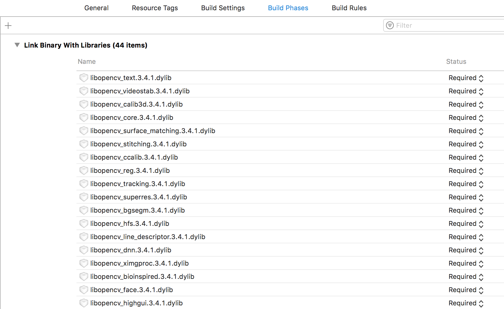

# 计算机视觉之 Get Started

> ⏰ 2018-03-27 00:18:00<br/>
> 👨🏻‍💻 painterdrown

[TOC]

## 1. 前言

今晚实验室老师开会，说打算开始带我和另外一位同学做 CV 以及神经网络。为了更系统地学习和记忆，接下来我打以博客的形式记录下学习过程及心得等等。

## 2. 部署环境

师兄提到玩计算机视觉必定要碰 OpenCV，所以这里讲一下我的安装过程。

### 2.1 brew 安装

由于我用的是 macOS，比较方便的做法是：Xcode + OpenCV 的环境。

1. 使用 brew 安装：`brew install opencv`

2. 安装完之后，可以看到以下目录及文件：

    + /usr/local/Cellar/opencv
    + /usr/local/include
    + /usr/local/lib

3. Xcode 新建命令行程序项目，在工程文件下进行以下设置：

    + Build Phases -> Link Binary With Libraries 添加 /usr/local/Cellar/opencv/<版本>/lib 中的所有 .dylib 文件

    

    + Build Settings -> Search Paths 添加 /usr/local/include 和 /usr/local/lib

    

4. 配置完毕，在 cpp 文件直接：`#include "opencv2/opencv.hpp"`，测试代码：

  ```C++
  #include "opencv2/opencv.hpp"
  using namespace cv;

  int main(int argc, const char * argv[]) {
      Mat image;
      image = imread("test.jpeg");  // 这里换成图片的绝对路径
      namedWindow("Hello OpenCV!", WINDOW_AUTOSIZE);
      imshow("Hello OpenCV!", image);
      waitKey(0);
      return 0;
  }
  ```

如果需要部署 python 环境，就通过 `ln -s` 来把 cs2.so 文件（在 opencv 安装目录找到）软连接到 python 的 packages 目录下，这里不赘述。

### 2.2 源码编译安装

最近在看《OpenCV 3 计算机视觉 Python 语言实现》，里面需要搭 OpenCV + Python 的环境，此外要需要引入外部模块 contrib。为了满足这些条件，这次是用源码编译安装的。

1. 获取源码

```sh
git clone https://github.com/opencv/opencv.git
git clone https://github.com/opencv/opencv_contrib.git
cd opencv
mkdir build
cd build
```

2. 编译、安装

```sh
cmake -D CMAKE_BUILD_TYPE=RELEASE \
      -D CMAKE_INSTALL_PREFIX=/usr/local \
      -D PYTHON2_PACKAGES_PATH=/usr/local/lib/python2.7/site-packages \
      -D OPENCV_EXTRA_MODULES_PATH=../../opencv_contrib/modules ..
make -j4
sudo make install
```

## 3. Resources

+ [吴恩达 (Andrew Ng) 关于机器学习的公开课](http://open.163.com/special/opencourse/machinelearning.html)
+ [王晓刚（香港中文大学）教授关于深度学习的课程](http://www.ee.cuhk.edu.hk/~xgwang/)
+ [李飞飞关于 CNN 的计算机视觉公开课](http://study.163.com/course/courseMain.htm?courseId=1004697005)
