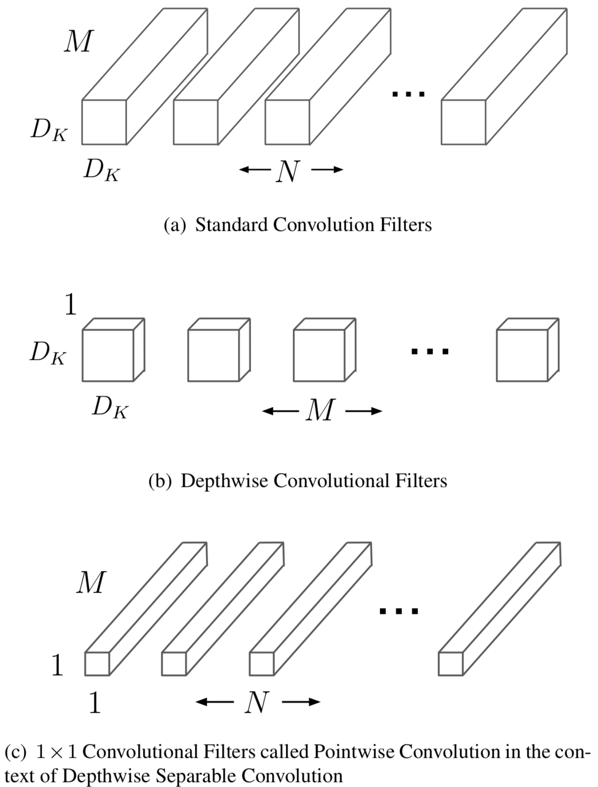
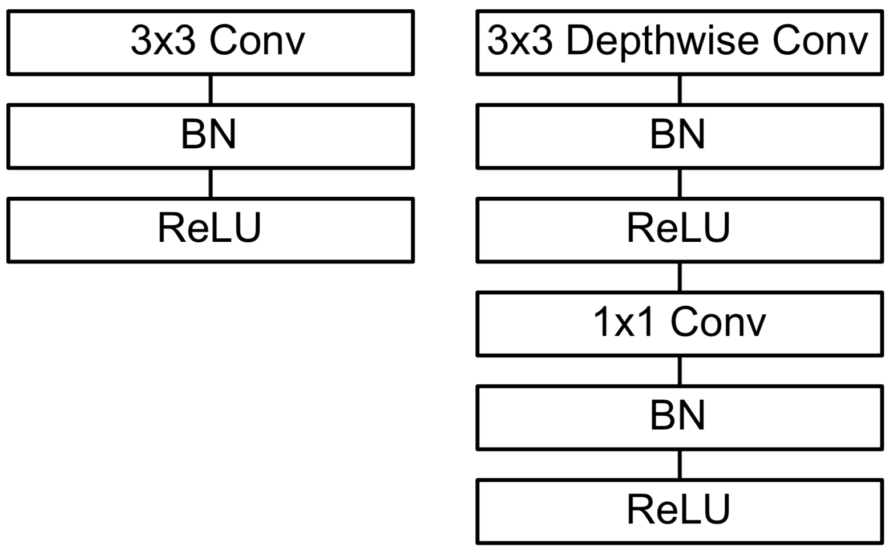

[painterdrown Blog](https://painterdrown.github.io) - [painterdrown CV](https://painterdrown.github.io/cv)

# MobileNets 学习笔记

> ⏰ 2018-05-28 13:02:24 
> 👨🏻‍💻 painterdrown

[TOC]

## 0. Abstract

> MobileNets are based on a streamlined architecture that uses **depthwise separable convolutions** to build light weight deep neural networks.

整篇论文高频出现一组词：**depthwise separable convolutions（深度可分离卷积）**，这也是 MobileNets 的核心——卷积分离可以大幅度减少计算量。

## 1. Introduction

目前的用于图像分类、目标识别的卷积神经网络模型，都不断地加深以及复杂化网络结构以追求更高的精度。很多现实中的应用其实对精度要求不是很苛刻，但同时又希望能做到实时的速度，特别是用于一些计算资源有限的设备上。

这篇论文主要介绍了 MobileNets 这个高效的网络架构，以及它的两个超参数：**width multiplier** & **resolution multiplier** 来构建轻量、低延时、适用于移动设备和嵌入式设备的网络模型。

## 2. Prior Work

在构建轻量高效的网络模型这一问题上，很多方法的原理基本可以分为两大类：对预训练出来的网络进行压缩 or 直接训练小网络。这篇论文将介绍如何合适地“挑选”一个小网络。

MobileNets 中使用 **depthwise separable convolutions** 的做法其实在在 Inception models 中已经有了，Flattened networks 也做过分解卷积，etc。

构造小网络的另外一种方法是 shrinking, factorizing or compressing pretrained networks。另外一个训练小网络的方法是 distillation（蒸馏），意思是先训练一个大网络出来，然后用这个大网络去 teach 出来一个小网络。

## 3. MobileNet Architecture

在 MobileNets 中，核心无非是它的 **depthwise separable filters**，下面也将从 width multiplier & resolution multiplier 两个超参数的角度来介绍其架构。

### 3.1. Depthwise Separable Convolution

MobileNets 将标准的卷积层分解成两部分：

1. **3\*3 depthwise convolution** 用于对输入进行过滤，输入为 $D_F · D_F · M$
2. **1\*1 pointwise convolution** 用于对过滤的结果进行结合，输出为 $D_F · D_F · N$

原先标准卷基层的计算量是：

$D_K · D_K · M · N · D_F · D_F$

分解后的计算量为：

$D_K · D_K · M · D_F · D_F + M · N · D_F · D_F$

两者相差了 8、9 倍。

### 3.2. Network Structure and Training

> All layers are followed by a batchnorm and ReLU nonlinearity with the exception of the final fully connected layer which has no nonlinearity and feeds into a softmax layer for classification.

这句话的意思是说 MobileNets 中除了最后的全连接层之外，其他层都接上了 batchnorm 和 ReLU。

### 3.3. Width Multiplier: Thinner Models

**Width Multiplier α** 做的事情其实就是对输入的通道数 M 压缩成 αM。加上 width multiplier α 的 depthwise separable convolution 的计算量为：

$D_K · D_K · αM · D_F · D_F + αM · αN · D_F · D_F$

### 3.4. Resolution Multiplier: Reduced Representation

**Resolution Multiplier ρ** 做的事情是输入输出的 feature map 的尺寸进行压缩。同时加上 width multiplier α 和 resolution multiplier ρ 的 depthwise separable convolution 的计算量为：

$D_K · D_K · αM · ρD_F · ρD_F + αM · αN · ρD_F · ρD_F$

## 4. Resources

+ [MobileNets: Efficient Convolutional Neural Networks for Mobile Vision Applications](../papers/MobileNets.pdf)
+ [chuanqi305/MobileNet-SSD（非官方）](https://github.com/chuanqi305/MobileNet-SSD)
