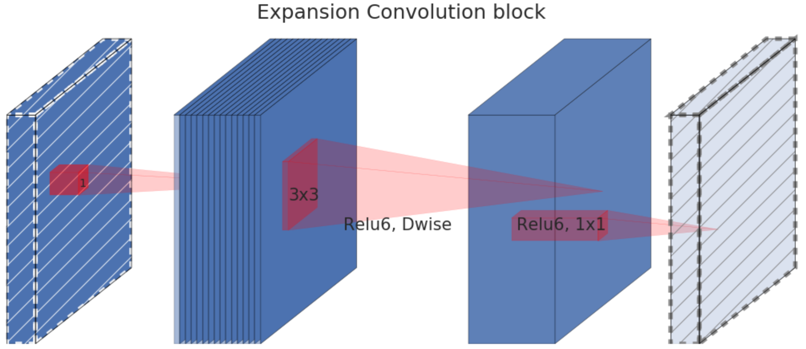
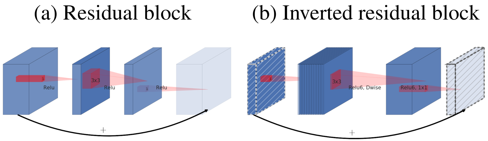

[painterdrown Blog](https://painterdrown.github.io) - [painterdrown CV](https://painterdrown.github.io/cv)

# MobileNetV2 学习笔记

> ⏰ 2018-05-28 19:16:22 
> 👨🏻‍💻 painterdrown

@[toc]

## 0. Abstract

这篇论文介绍了一种新的移动神经网络架构 **MobileNetV2**，提升了多任务的表现以及涵盖了不同大小的模型。SSDLite 用于目标检测，MobileDeepLabv3 用于语义分割。MobileNetV2 是基于残差结构，其中间拓展层使用了非线性轻量深度卷积来对 feature map 进行过滤。MobileNetV2 支持对输入输出域做解藕。

## 1. Introduction

意思大概是，目前最前沿的用于目标检测的神经网络模型，都需要大量的计算资源，因此不适用于移动设备和嵌入式设备。MobileNetV2 应运而生，有三个特点：

1. 无需大量的计算
2. 无需大量的内存开销
3. 保持着良好的检测精度

上面说的三点其实跟 MobileNets 一样。而 MobileNetV2 的主要创新之处是在神经网络层：the inverted residual with linear bottleneck（线性瓶颈的反向残差结构）。我在 CSDN 找到[一篇论文](https://blog.csdn.net/u011995719/article/details/79135818)是这样解释的：

> 通常的 residuals block 是先经过一个 1\*1 的 conv layer，把 feature map 的通道数“压”下来，再经过 3\*3 conv layer，最后经过一个 1\*1 的 conv layer，将 feature map 通道数再“扩张”回去。即先“压缩”，最后“扩张”回去。而 inverted residuals就是 先“扩张”，最后“压缩”。

> linear bottlenecks，为了避免 relu 对特征的破坏（我们知道 relu 函数只取输入的非负值，且认为这个行为导致了信息损失），在 residual block 的 Eltwise sum 之前的那个 1\*1 conv 不再采用 relu。

这个方法先是接收一个低维、压缩的特征表示，然后拓展其到高维，在用一个轻量深度卷积进行过滤。过滤后得到的特征会被一个线性卷积映射回低维的表示。

## 2. Preliminaries（准备工作）, Discussion and Intuition（直觉）

### 2.1. Depthwise Separable Convolutions

> 参考：[MobileNets 学习笔记](https://painterdrown.github.io/cv/mobilenet) 中的 Depthwise Separable Convolution

这里的深度可分离卷积跟 MobileNets 的唯一区别在于：MobileNets 的输入输出都是正方形的 feature，而 MobileNetV2 则允许长宽不一样。

### 2.2. Linear Bottlenecks（线性瓶颈）

这一段不太好理解，我感觉就是 ReLU 会损失负数的那部分信息，因此要想办法换成不会损失信息的线性激活函数。作者提到两点：

1. 如果经过 ReLU 之后，**manifold of interest**（formed by a set of layer activations） 还是非零的话，其相当于做了一个线性转换而已。
2. 如果 manifold of interest 是处于低维子空间中，经过 ReLU 时就不会损失信息。

因此，如果 manifold of interest 是低维的话，我们就可以通过往卷积块插入 linear bottleneck 层捕获之。

### 2.3. Inverted residuals（反向残差）

这一段更是看得我云里雾里的，遂果断查博客。

> [【百度经验】MobileNetV2: 反向残差和线性瓶颈](http://baijiahao.baidu.com/s?id=1597561152826234409)

残余块将卷积块的开始和结尾连接到跳过连接。通过添加这两个状态，网络有机会访问在卷积块中未修改的早期激活。这种方法对于建立深度网络非常重要。残余块将宽层与跳跃连接相连，而层之间的层较窄。

当我们稍微靠近跳过连接时，我们会注意到, 原始的残余块会跟随一个宽 >> 窄 >> 宽的方法来处理通道的数量。输入信道数量很多，并用廉价的 1\*1 卷积进行压缩。这样下面的 3\*3 卷积的参数就少得多了。为了最终增加输入和输出，使用另一个 1\*1 卷积再次增加通道的数量。

> [【知乎】如何评价mobilenet v2 ?](https://www.zhihu.com/question/265709710/answer/297996096)

## 3. Model Architecture

1. 全卷积层，有 32 个过滤器
2. 19 residual bottleneck layers
3. 非线性激活函数 ReLU6
4. kernel size 3 × 3
5. 训练时用 dropout & batch normalization 来防止过拟合
6. 除了第一层，剩下的网络都用了 constant expansion rate（小网络要用小 ER，大网络要用大 ER）

## 4. Resources

+ [MobileNetV2: Inverted Residuals and Linear Bottlenecks](../papers/MobileNetV2.pdf)
+ [chuanqi305/MobileNetv2-SSDLite（非官方）](https://github.com/chuanqi305/MobileNetv2-SSDLite)
