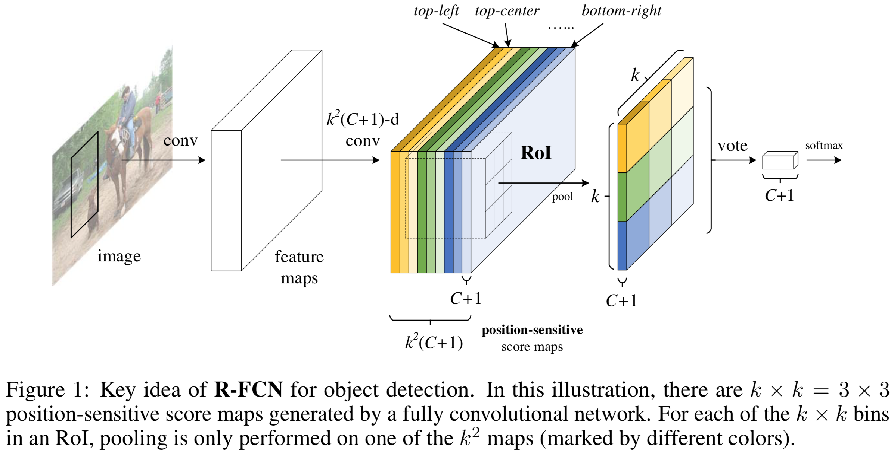
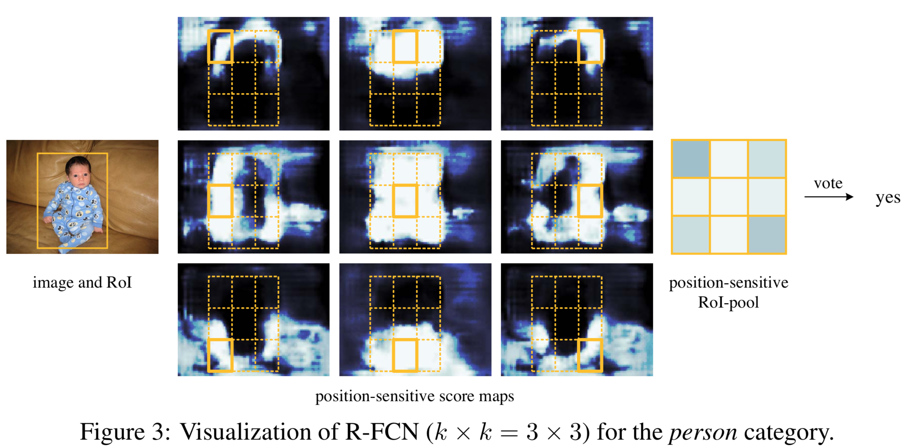
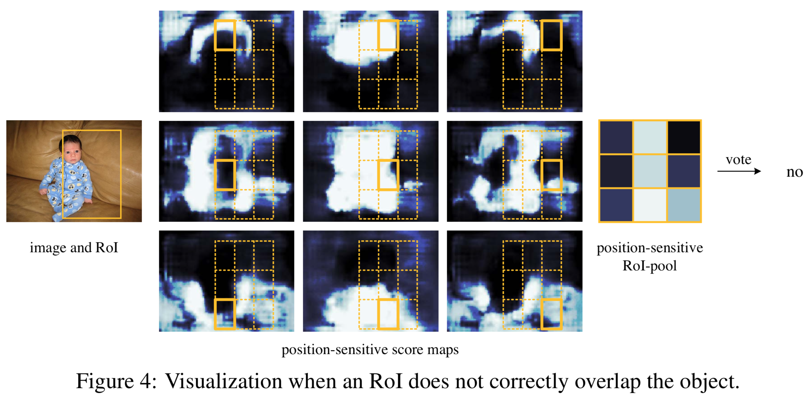
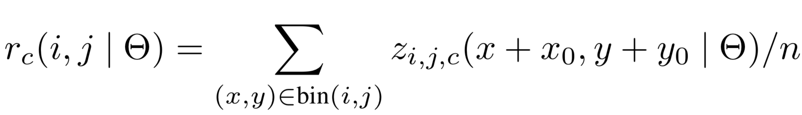

[painterdrown Blog](https://painterdrown.github.io) - [painterdrown CV](https://painterdrown.github.io/cv)

# R-FCN 学习笔记

> ⏰ 2018-05-30 21:07:51 
> 👨🏻‍💻 painterdrown

@[toc]

在 [Faster R-CNN](https://painterdrown.github.io/cv/faster-rcnn) 里面就有提到 FCN（全卷积网络） 这个概念，是指 RPN (Region-based Proposal Networks) 加上一个做 regress region bounds & objectness scores 的卷积层，就称为 FCN。这篇论文称其为 R-FCN，含义上没有什么大的差别。

## 0. Abstract

这里先是说 Fast/Faster R-CNN 做目标检测时做的计算太多（每张图片选很个 region，导致了比较多的重复计算），然后说 R-FCN 只需计算一整张图片的 convolutional feature。

> To achieve this goal, we propose position-sensitive score maps to address a dilemma between translation-invariance in image classification and translation-variance in object detection.

作者说，想要在 translation-invariance in image classification 和 translation-variance in object detection 之间达到一个 "dilemma（进退两难的窘境）" 的状态（实话说我也很纳闷，先往下看再说）。这样一来，这个网络就能自然地采用一些其他的骨干网络，比如 [ResNets](../papers/ResNets.pdf)用于目标检测。

所以这里我的理解是，"dilemma" 是为了让 R-FCN 更好地适配不同的任务：加上 ResNet 就可以用于目标检测，加上 XXNet 就可以用作其他用途了。

## 1. Introduction

传统的目标检测网络可以根据 RoI 吃化层划分为两种类型：

1. 全卷积层计算可共享，但是独立于 RoIs（也就是说 RoI 层还要单独计算）
2. RoI-wise subnetwork that does not share computation（我的理解是 RoI 现在不独立，但是也没有分享计算）

很多传统的分类网络 ([AlexNet](../papers/AlexNet.pdf), [VGG](../papers/VGG.pdf)) 的架构都是：卷积子网络 (ending with a spatial pooling layer) 后面加上几个全连接层。

然而，state-of-the-art 的图像分类网络 ([ResNets](../papers/ResNets.pdf), [GoogLeNet](../papers/)) 都是用的 FCN（全卷积网络），计算的时候会将 RoI 考虑进来。但是这种架构在实际使用的时候存在一个 "inferior detection accuracy（较差检测精度）" 的问题。ResNets 尝试在 Faster R-CNN 中的 RoI 池化层前后都插入 (unnaturally) 卷积层。这提升了精度，但由于 RoI 池化层的计算还不是共享的，所以会花费大量的计算时间。

上述提到了在精度和速度之间的两难境地，就是 Abstract 里面提到的 **dilemma**。图像分类 (image-level) 倾向于 translation invariance（转换不变性）——也就是说，在图像分类里面，图像转换如缩放、旋转等不应该影响分类结果。在另一方面，目标检测则更倾向于 translation variance（转换可变性）——也就是说，在做目标检测的时候，检测出来目标的位置会对图像转换敏感。这个很好理解，往往一张图片旋转缩放之后，图像里面目标的位置就变了，所以你检测的结果也应该随之而变。

ResNets 为了达到这个 dilemma，它在其检测流水线的卷积中插入了 RoI 池化层（这个操作是 region-specific 的）。这样一来就打破了 translation invariance，在后面的 RoI 池化层在多个不同 region 上就不会具有 translation-invariant。总而言之，ResNets 这样的设计牺牲了训练和测试的效率，因为涉及了大量的 region-wise layers（暂时不理解这种层是什么东西）。

回到正题，这篇论文提出了一个用于目标检测的框架——R-FCN。通过一系列的 position-sensitive score maps，将 translation variance 融入 FCN。每一个 score map 会对相对位置信息进行编码。在 FCN 的顶层，有一层 position-sensitive RoI pooling layer 对这些编码后的信息进行解译。R-FCN 是端到端的架构，所有的卷积层都共享一整张图片的计算。

R-FCN 用 ResNet-101 作为网络骨干，在 VOC 上的 mAP 达到了 82%！测试时，每张图片耗时 170ms，可以说非常优秀了！

## 2. Our Approach

首先看下 R-FCN 的整体架构：

R-FCN 也是通过 RPN 来获取 region proposals，后面对于每一个 RoI，都输出 k^2^(C+1)-channel 个分类结果。这里的 k^2^ 是有讲究的：比如说 k = 3 时，k^2^ = 9 对于前面提到的 9 个 encoded 的相对位置 { top-left, top-center,
top-right, ..., bottom-right }。

R-FCN 的最后一层是 position-sensitive 的 RoI 池化层（有选择性的），其聚合了前面卷积层的输出并且对于每个 RoI 都生成分类得分。参考 Introduction 中的那张图片，中，每一个 RoI 从前面的 k^2^ 个 score maps bank 中拿出自己每个位置的得分，然后进行投票，判断这个 RoI 是否属于某个分类。

### 2.1. Backbone Architecture

ResNet-101（ImageNet 预训练得到） 去掉 average pooling layer 和最后的全连接层，留下卷积层来计算 feature maps。ResNet-101 最后一个卷积层是 2048 维的，为了降低维度，后面接上一个 1024 维的随机初始化的卷积层。然后再接上 k^2^(C + 1)-channel 的卷积层来生成 score maps。

### 2.2. Position-sensitive Score maps & Position-sensitive RoI Pooling

每个 RoI 区域被分成 k×k 个网格，分别对应相对（相对于这个 RoI）的位置信息。每一个 RoI 从同一个 score maps 里面提出出各自的分类得分，每个 RoI 得到 k^2^ 个得分之后，取平均来判断这个 RoI 为分类的概率。

对于 bounding box regression 也是采用类似的做法：先生成 4k^2^ 的 regression maps（跟前面生成 k^2^(C + 1)-channel 的卷积层是 sibling 关系），再对每个 RoI 进行池化，投票。

### 2.3. Training

跟 Fast R-CNN 类似，损失函数同时考虑分类和回归两个 task。首先假设每张图片有 N 个 proposals，前向计算其 loss，对结果进行排序，取前 B 个 RoI。然后做反向传播的时候只做这 B 个。由于每个 RoI 的计算时间可以忽略不计，因此前向的计算基本跟 N 没有关系。

R-FCN 使用的 0.0005 的 decay 和 0.9 的 momentum。默认地，训练只做一个图像尺寸，每张图片 resize 使其较短的边都是 600px。When doing fine-tune, using a learning rate of 0.001 for 20k mini-batches and 0.0001 for 10k mini-batches on VOC.

## 3. Resources

+ [R-FCN: Object Detection via Region-based Fully Convolutional Networks](../papers/R-FCN.pdf)
+ [GitHub (MATLAB)](https://github.com/daijifeng001/r-fcn)
+ [GitHub (python)](https://github.com/YuwenXiong/py-R-FCN)

另外，我在 Medium 找到两篇关于解读以及实现 ResNets 的博客，感觉很不错：

+ [Understanding and Implementing Architectures of ResNet and ResNeXt for state-of-the-art Image Classification: From Microsoft to Facebook [Part 1]](https://medium.com/@14prakash/understanding-and-implementing-architectures-of-resnet-and-resnext-for-state-of-the-art-image-cf51669e1624)
+ [Understanding and Implementing Architectures of ResNet and ResNeXt for state-of-the-art Image Classification: From Microsoft to Facebook [Part 2]](https://medium.com/@14prakash/understanding-and-implementing-architectures-of-resnet-and-resnext-for-state-of-the-art-image-cc5d0adf648e)

~~最后，胆小的我发现论文里面这组图很有鬼片既视感，一起感受一下：~~

