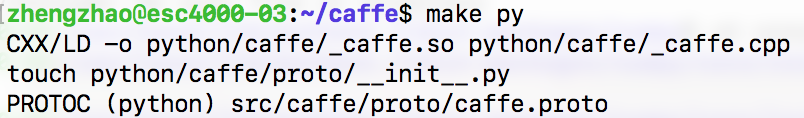
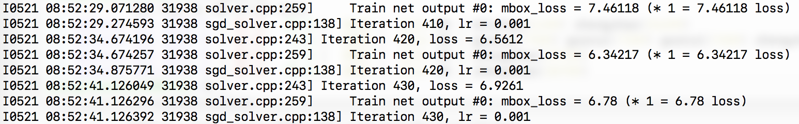
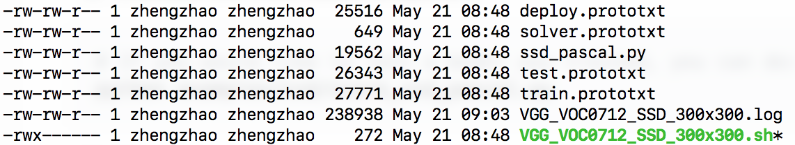
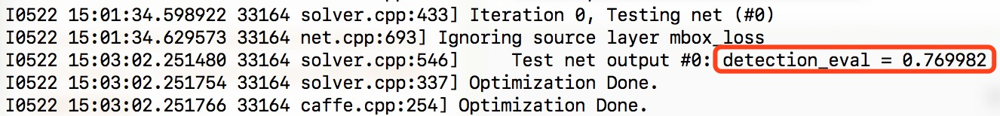

[painterdrown Blog](https://painterdrown.github.io) - [painterdrown CV](https://painterdrown.github.io/cv)

# SSD - Notes & Practice

> ⏰ 2018-05-21 08:22:22<br/>
> 👨🏻‍💻 painterdrown

[TOC]

## 1. 装 caffe

实验室的服务器（Ubuntu 16.04）已经装好了 CUDA, cuDNN, OpenCV 的环境，所以现在只需要编译一下 Caffe 就可以跑。

> 官方安装教程：https://github.com/weiliu89/caffe/tree/ssd#installation

跟着这个教程走完 **Installation** 和 **Preparation**。

> 我的 [Makefile.config](assets/Makefile.config) & [Makefile](assets/Makefile)

PS: 由于在编译的时候遇到了一个关于 `hdf5` 和 `undefined reference to「boost::re_detail::raise_runtime_error(std::runtime_error const&)」` 的错误，需要修改下 Makefile:

```sh
# 原来版本：LIBRARIES += glog gflags protobuf boost_system boost_filesystem boost_regex m hdf5_hl hdf5
LIBRARIES += glog gflags protobuf boost_system boost_filesystem m hdf5_serial_hl hdf5_serial boost_thread stdc++ boost_regex
```

我这边 `make py` 的结果：



## 2. 训练 & 评估

### 2.1 Train & Evaluate(顺便)

```sh
# time: 08:48
python examples/ssd/ssd_pascal.py
```

开始跑：




以及 GPU 的状态如下（zhengzhao 是我）：


刚开始用 `tmux`，不小心关掉了窗口，看不到输出，只能等它跑完了...这是 `ps` 查到的进程状态（先是通过 ps）：

```sh
# 找到相应进程的 ID（其实已经包含线程状态了）
ps aux
...

# 查看进程的状态
ps <pid>
  PID TTY      STAT   TIME COMMAND
31938 ?        Sl   385:59 ./build/tools/caffe train --solver=models/VGGNet/VOC0712/SSD_300x300/solver.prototxt --weights=models/VGGNet/VGG_ILSVRC_16_layers_fc_reduced.caffemodel --gpu 0,1,2,3
```

我观察了一下，跑 200 次迭代需要 123 秒。这次训练需要 120k 次迭代，大概要跑 20 个小时......漫长等待之后，可以在 `$HOME/data/VOCdevkit/results/VOC2007/SSD_300x300/` 看到运行的结果：


训练出来的模型在 `$CAFFE_ROOT/models/VGGNet/VOC0712/SSD_300x300/`:


还有这次训练的其它 job file, log file, python script 在 `$CAFFE_ROOT/jobs/VGGNet/VOC0712/SSD_300x300/`:



### 2.2 Evaluate

> It should reach 77.* mAP at 120k iterations.

官方说能达到 77 的 mAP，现在来测试一下。

```sh
python examples/ssd/score_ssd_pascal.py
```

输出如下：



可以看到是有 **76.99** 的 mAP，没有 77 有点小失望。

### 2.3 Test Using a Webcam

这一步就算了，我这里没有网络摄像头。

### 2.4 Test

> Check out examples/ssd_detect.ipynb or examples/ssd/ssd_detect.cpp on how to detect objects using a SSD model. Check out examples/ssd/plot_detections.py on how to plot detection results output by ssd_detect.cpp.

这里是在说有 Jupyter 文档说明如何用 SSD 来做目标检测以及如何圈出检测结果。我把 Jupyter 转成了 HTML：[examples/ssd_detect.ipynb](assets/ssd_detect.html)。

附上 [examples/ssd/ssd_detect.cpp](assets/ssd_detect.cpp) 和 [examples/ssd/plot_detections.py](assets/plot_detections.py)。

### 2.5 Train on Other Dataset

> To train on other dataset, please refer to data/OTHERDATASET for more details. We currently add support for COCO and ILSVRC2016. We recommend using examples/ssd.ipynb to check whether the new dataset is prepared correctly.

我尝试着跑 examples/ssd_detect.ipynb 里面的代码，但是人家是 IPython 解释器跑的，所以这一句：`%matplotlib inline` 不能在 CPython 里面运行（我也不了解怎么把这句翻译到 CPython 里面）。所以也显示不了最终的效果图，但是代码是可以跑起来的，这就够啦嘿嘿。代码的思路：

1. 设置 caffe 的基本配置（CAFFE_ROOT）
2. 引入训练好到模型 `models/VGGNet/VOC0712/SSD_300x300/VGG_VOC0712_SSD_300x300_iter_120000.caffemodel`
3. 加载测试图片，喂到模型里面，得到 classsification score 和 bounding box

## 3. BTW

### 3.1 Linux 进程状态

+ `D` 不可中断 Uninterruptible sleep(usually IO)
+ `R` 正在运行，或在队列中的进程
+ `S` 处于休眠状态
+ `T` 停止或被追踪
+ `Z` 僵尸进程
+ `W` 进入内存交换（从内核 2.6 开始无效）
+ `X` 死掉的进程

进程状态的修饰：

+ `<` 高优先级
+ `N` 低优先级
+ `L` 有些页被锁进内存
+ `s` 包含子进程
+ `+` 位于后台的进程组
+ `l` 多线程，克隆线程

### 3.2 tmux 常用操作

+ `tmux new -s <name>` 新建会话并取个名字。
+ `tmux ls` 查看所有会话。
+ `tmux a -t <name>` 进入某个会话。
+ `tmux kill-session -t <name>` 终止某个会话。
+ `Ctrl + B + D` 退出某个会话（仍在后台）。
+ `Ctrl + B + S` 切换到另外的会话。

### 3.3 在 macOS Terminal 通过 ssh 显示服务器的图形化界面

> https://uisapp2.iu.edu/confluence-prd/pages/viewpage.action?pageId=280461906

1. mac 本地先安装 [XQuartz](https://www.xquartz.org)
2. ssh 连接的时候带上 `-X` 参数：`ssh user@host -X`
3. 之后，在 ssh 里面进行图形化相关的操作，就会在 mac 本地显示出来

## 4. Resources

+ [SSD: Single Shot MultiBox Detector](assets/SSD.pdf)
+ 官方源码：https://github.com/weiliu89/caffe/tree/ssd
