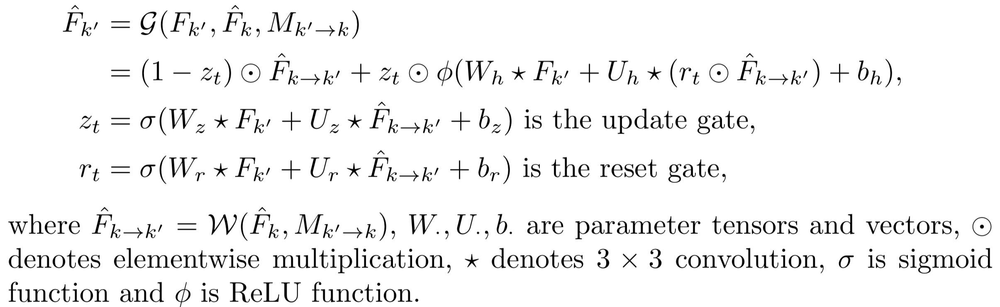

[painterdrown Blog](https://painterdrown.github.io) - [painterdrown CV](https://painterdrown.github.io/cv)

# Towards High Performance Video Object Detection for Mobiles 学习笔记

> ⏰ 2018-06-03 13:10:07 
> 👨🏻‍💻 painterdrown

[TOC]

## 0. Abstract

> [Towards High Performance Video Object Detection 学习笔记](https://painterdrown.github.io/cv/thp)

尽管已经在视频目标检测取得了不错的效果（参考上面 👆 的学习笔记），但是目前的架构对于手机来说还是太重了，也不清楚将 sparse feature propagation 以及 multi-frame feature aggregation 应用在计算资源比较有限的手机里，效果会受多大的影响。——因此，这篇论文提出了一个轻量级（聚焦于 sparse key frames）的视频目标检测框架。

## 1. Introduction

要把目前最好的这套视频目标检测框架移植到手机设备上，还是存在着一些问题。比如说，特征传播和特征聚集共同的 flow estimation 离要在手机上做到实时，还有比较大的一段差距。做聚集的时候，由于手机内存的限制，也不能取太大的帧区间。

要在手机上做视频目标检测，还是要秉持两大原则：

1. 对关键帧做特征聚集。
2. 对非关键帧做特征传播。

当时这两者的结构都需要针对手机进行重新设计：

1. 使用一个轻量级的深度神经网络 **Light Flow** 来做 flow feature estimation（手机能够无压承受）。
2. 对于稀疏关键帧，用 **flow-guided GRU** ([Gated Recurrent Unit](https://en.wikipedia.org/wiki/Gated_recurrent_unit)，后面的 Resources 里有视频链接) 来做特征聚集。
3. 改用轻量的目标检测网络，参考：
  + [Rigid-motion scattering for image classification](https://www.di.ens.fr/data/publications/papers/phd_sifre.pd)（直接给链接了，速度太慢我没下载）
  + [Light-Head R-CNN](../papers/Light-Head_R-CNN.pdf)

## 2. Revisiting Video Object Detection Baseline

关于 **Sparse Feature Propagation** 和 **Multi-frame Feature Aggregation** 我就不再赘述了。

这两个准则在桌面 GPU 下的表现很好。手机上的准则要做一些调整：

+ 只对关键帧做特征提取和聚集，对非关键帧做轻量的特征传播。
+ 用 FlowNet 在手机上做 flow estimation 比较奢侈，FLOPS (floating point operations per second) 是 MobileNets 的 11.8 倍（在相同的输入分辨率下）。因此急需一个更轻量的 N~flow~。
+ 应该在对齐（根据流信息）的特征图上做聚集，否则，大目标的位移会给聚集带来误差。要想办法做长区间的特征聚集（就要克服内存不足的问题）。
+ 用于计算关键帧特征的卷积网络要尽量小。

## 3. Model Architecture for Mobiles

### 3.1. Light Flow

FlowNet 是 pixel-level 的光流估算网络。FlowNet 先通过卷积对输入图像进行编码得到特征图（大小变为原来的 1/64），解码的时候，特征图经过几个反卷积层，得到高分辨率的流精度信息。在每个反卷积层的后面，结果特征图都会与解码器的最后一个特征图联系起来，两者共享空间分辨率以及一个未被采样的较为粗糙的流精度。解码器中的特征图会各自经过 optical flow predictors，然后根据损失函数选取精度最好的 predictor 用于 inference。

基于 FlowNet，**Light Flow** 做了几处修改，稍微损失了精度，但是理论上能提速 65 倍。

+ 在 encoder，卷积是计算的瓶颈。受 [MobileNets](../papers/MobileNets.pdf) 的激发，所有卷积层重新采用 3×3 的深度可分离卷积 (3×3 depthwise convolution + 1×1 pointwise convolution)。这样做可以提速 8~9 倍。
+ 在 decoder，每个反卷积操作都用 nearest-neighbor upsampling（最近邻居向上采样）替代，这可以通过标准卷积来达到反卷积 checkerboard artifacts（这里不了解）的作用。接着，再在标准卷积上做深度可分离的分解以减少计算。

此外，与 FlowNet 不同的是，作者做的是 multi-resolution prediction。对 multi-resolution 进行向上采样，达到一个与最佳预测相同的空间分辨率，之后取均值作为最终的 prediction。训练的时候，也只有一个作用在 averaged optical flow prediction 上面的损失函数，这样能减少端点 10% 的错误率。

Light Flow 的架构如上表所示，每一个卷积操作后面都跟有一个 batch normalization 以及 Leaky ReLU nonlinearity。Light Flow 是在 Flying Chairs dataset 上预训练的。

此外还有两个方法能加速 Light Flow：

1. 输入尺寸取 N~feat~ 的一半，输出层的步长设为 4（N~feat~ 的步长为 16），相当于做了下采样。
2. 在检测网络中，对中间过程的特征图做稀疏特征传播，进一步减少非关键帧上的计算。

### 3.2. Flow-guided GRU based Feature Aggregation

Recursive aggregation 能够更好地结合邻近帧的信息，但是很难被训练来做长区间的特征聚集。研究表明：GRU 相比于 LSTM, RNN 更适合将长期的依赖关系进行模型化 (modeling long-term dependencies)。因此，作者将 **convolutional GRU** 收纳入 FGFA 中，聚集操作更改为：

相比原生的 GRU，有下面三点区别：

1. 用的是 3×3 的卷积而不是全连接的矩阵乘法
2. 激活函数用的是 ReLU 而不是 tanh，速度更快，更容易收敛
3. GRU 只应用在关键帧上

### 3.3. Lightweight Key-frame Object Detector

+ **Feature Network**: MobileNets 去掉最后一层的平均池化以及其他的全连接层，保留卷积层
+ **Detection Network**: RPN + Light-Head R-CNN，RPN 中间的特征图缩小一半的通道。最后是 RoI 的 warped feature 输入到两个 sibling（分类和回归）全连接层，得到最终的结果。

### 3.4. End-to-end Training

N~feat~, N~det~ 和 N~flow~ 都可以连接在一起，进行端到端的训练 (for video object detection task)。

## 4. Resources

+ [Towards High Performance Video Object Detection for Mobiles](../papers/Towards_High_Performance_Video_Object_Detection_for_Mobiles.pdf)
+ [吴恩达讲解 GRU](https://www.coursera.org/learn/nlp-sequence-models/lecture/agZiL/gated-recurrent-unit-gru)
