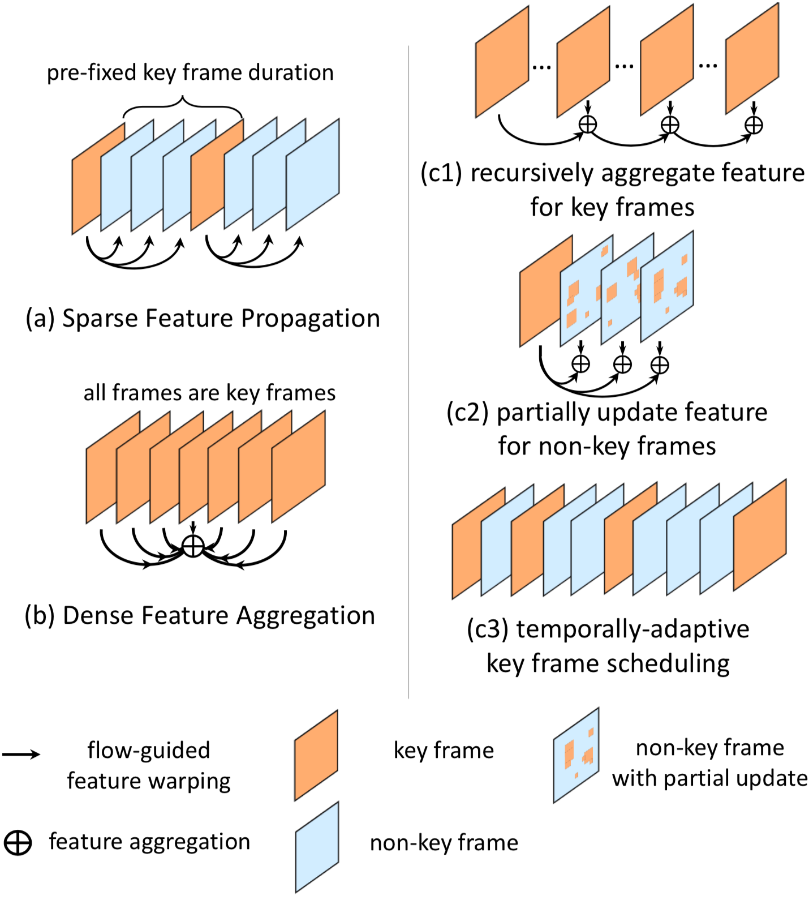
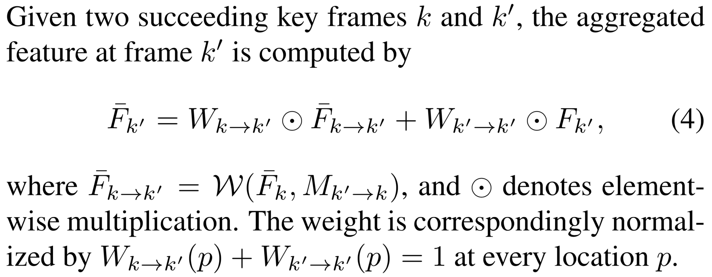
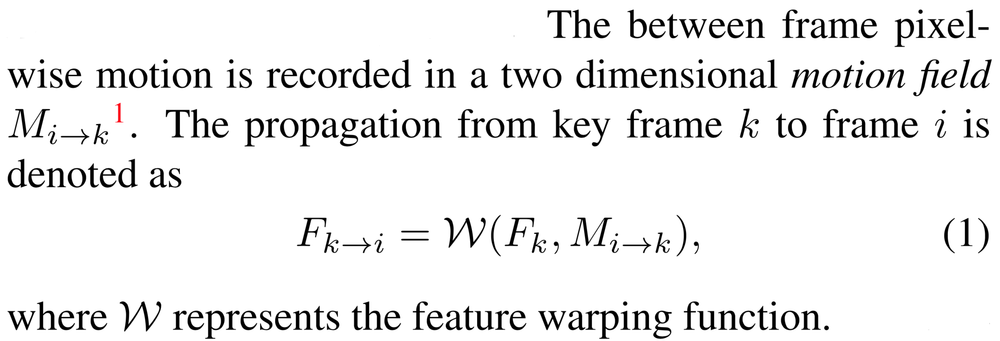
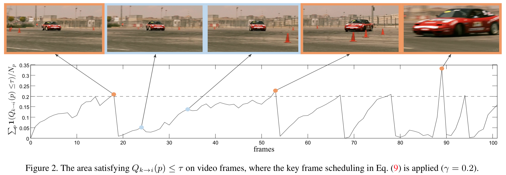
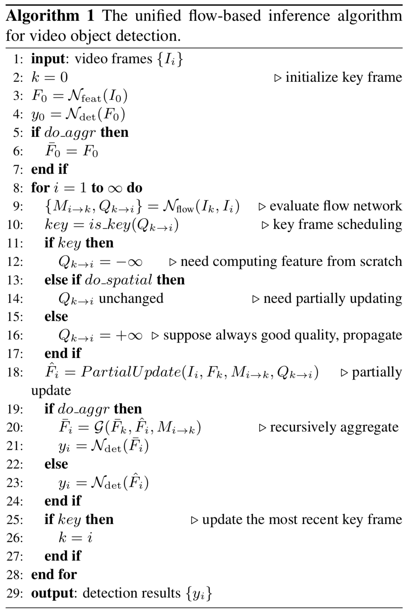

[painterdrown Blog](https://painterdrown.github.io) - [painterdrown CV](https://painterdrown.github.io/cv)

# Towards High Performance Video Object Detection 学习笔记

> ⏰ 2018-06-03 00:21:48 
> 👨🏻‍💻 painterdrown

@[toc]

## 0. Abstract

这篇论文是基于前面 [DFF](../papers/DFF.pdf) 和 [FGFA](../papers/FGFA.pdf) 的基础之上，提出了一个旨在多帧、端到端的 feature 及 cross-frame motion 的深度学习方法。提出了三项新技术来提高稳定性，优化速度和精度，以及在两者之间做权衡。

## 1. Introduction

之前的两项工作都有各自的缺点：**DFF** (Deep Feature Flow for Video Recognition) 中许多帧的特征都是由关键帧的特征传播得到的，只是一个近似的结果，存在着较大的误差（优势是速度）。**FGFA** (Flow-Guided Feature Aggregation for Video Object Detection) 则为了提升精度，多做了 motion estimation, feature propagation 和 aggregation，但是速度上又受限。

两者共同的主旨：motion estimation 模块放在了网络中来计算，而且整个网络框架是端到端的。

此论文要介绍的方法基于两者，效果更快、更准、更稳定。三项新技术分别是：

1. **sparsely recursive feature aggregation**（稀疏递归特征聚集）。这项技术用来在特征聚集时保持特征的质量，同时又减少了计算开销（与 DFF 一样，也是只对关键帧进行操作）。可以说，这项技术吸取了前面 DFF 和 FGFA 的精华，且效果优于两者。

2. **spatially-adaptive partial feature updating**（空间自适应部分特征更新）。用于在非关键帧上重新计算特征（尽管传播的质量很差）。这项技术显著地提升了最终的检测精度。

3. **temporally-adaptive key frame scheduling**（时间自适应关键帧调度）。之前的 DFF 是固定长度地选取关键帧（这样效果很一般），现在这项技术能预测一个关键帧的用途，即关键帧特征的质量。

## 2. From Image to Video Object Detection

现在的图像目标检测已经比较成熟，一般分两步走：

1. 在 ImageNet 上预训练一个全卷积网络骨架 N~feat~，然后进行微调
2. 在 N~feat~ 算出来的特征图上，做 region classification 和 bounding box regression，这个网络 N~det~ 可分为两大类：
  + **sparse object proposals（稀疏目标建议）**，比如 R-CNN 系列，[DCNets (Deformable Convolutional Networks)](../papers/DCNets.pdf) 等
  + **dense sliding windows（稠密滑动窗口）**，比如有 [SSD](../papers/SSD.pdf), [YOLO](../papers/YOLO.pdf) 等

接下来要讲的是视频目标检测里面的两个基础方法。

### 2.1. [Sparse Feature Propagation](../papers/DFF.pdf)

讲的其实就是前面的 DFF，详见：

> [Flow-Guided Feature Aggregation for Video Object Detection 学习笔记](https://painterdrown.github.io/cv/fgfa)

不过这里加了一个前缀 **sparse**，要理解的话应该是其是用来修饰关键帧的。因为只让关键帧进入全卷积层去算特征图，而且关键帧的数目占所有视频帧的比例比较小，因此修饰其为“稀疏”。

### 2.2. [Dense Feature Aggregation](../papers/FGFA.pdf)

同样的，讲的其实是上一篇的 FGFA，详见：

> [Flow-Guided Feature Aggregation for Video Object Detection 学习笔记](https://painterdrown.github.io/cv/fgfa)

前缀 **dense** 应当理解为：在对 reference frame 做聚集的时候，会聚集前后 K 帧的运动信息。这里是对 reference frame 周围的所有帧都做聚集，所以说是“稠密”。

## 3. High Performance Video Object Detection

### 3.1. Sparsely Recursive Feature Aggregation

> Exploits the complementary property and integrates the methods in DFF & FGFA, both accurate and fast.

前面 FGFA 的特征聚集，是对每个帧都做了一遍，虽说检测精度有明显提升，但是速度很慢。而且也没必要每一帧都做聚集，这样就浪费了邻近帧之间的相似信息。这里提到的新技术将只在关键帧上面做 recursive feature aggregation（递归特征聚集）。

上图是核心操作：假设我们已经聚集到了第 k 帧，接下里要聚集第 k^'^ 帧，则已经算好的中间量有：

+ 从 k 到 k^'^ 的聚集偏移量（上式右边的第一项）
+ 第 k^'^ 帧的全卷积特征图（上式右边的第二项）

两者各自与权重矩阵点乘后相加，得到第 k^'^ 帧到聚集特征。总结一下就是：第 k 帧的特征聚集了前面的帧特征，然后又传播给下一个关键帧 k^'^。

### 3.2. Spatially-adaptive Partial Feature Updating

> Extends the idea of adaptive feature computation from temporal domain to spatial domain, resulting in spatially-adaptive feature computation that is more effective.

前面 DFF 的特征传播，虽说检测速度提升了不少，但是对于非关键帧的检测精度来说很差。

这个式子得到的是从关键帧 k 到邻近非关键帧 i 的特征传播，不是直接的 i 的特征。所以，要得到 i 比较好的特征，就必须保证上式的这个特征传播质量。作者提出了一个新的概念来做这个事情：feature temporal consistency Q~k→i~。这是在 N~flow~ 的输出层加一个 sibling branch 来做预测，得到这个值。

算出 Q~k→i~ 后，通过一个阈值 τ 来判断其是否与 i 帧相容。如果低于阈值，说明 F~k→i~ （表示从 k 传播到 i 得到的特征）的效果不好，因此需要另外对 i 帧“打个补丁”—— updating with real feature F~i~(p)，也就是用卷积重新计算 i 的特征图进行更新：

值得注意到是，特征更新的过程是可以逐层进行的（用第 n-1 层来更新第 n 层）。

### 3.3. Temporally-adaptive Key Frame Scheduling

> Proposes adaptive key frame scheduling that further improves the efficiency of feature computation.

3.2 中提到的 feature temporal consistency Q~k→i~，我们可以用来做关键帧判断。可以这样简单的理解：如果 Q~k→i~ 很小，说明第 k 帧与第 i 帧的相容性低，这也就说明了 i 很大概率是下一个关键帧。

### 3.4. Inference

### 3.5. Training

跟 FGFA 训练过程一样，由于考虑到内存问题，在 SGD 的 mini-batch 中只选取两帧（先取的作为关键帧，后取的作为非关键帧）。

在做前向的过程中：

1. N~feat~ 先算出关键帧 k 的特征图 F~k~ 以及非关键帧的特征图 F~i~
2. N~flow~ 根据 F~k~, F~i~ 估计出 2D flow field M~i→k~ 以及 feature consistency indicator Q~k→i~
3. 根据 Q~k→i 来进行 partial feature updating 算出邻近帧（除了 i 之外的其他帧）的特征图
4. 利用上面的 feature buffer 来做 recursive feature aggregation，对下一个关键帧进行聚集
5. 最后把这些聚集的结果丢进 N~det~，得到检测结果

注意一下这里的损失函数为：

式子右边第一项是 Faster R-CNN 中的损失函数 (multi-task: 同时考虑了分类和回归的效果)，右边第二项的目的是对重新计算的区域大小进行限制（训练的时候按照 1:3 的概率使 U~k→i~ = 0/1），以提高 propagating feature 和 recomputing feature 的质量。

### 3.6. Network Architecture

+ **Flow network**: FlowNet (“simple” version)
+ **Feature network**: ResNet-101
+ **Detection network**: R-FCN

## 4. Resources

+ [Towards High Performance Video Object Detection](../papers/Towards_High_Performance_Video_Object_Detection.pdf)
