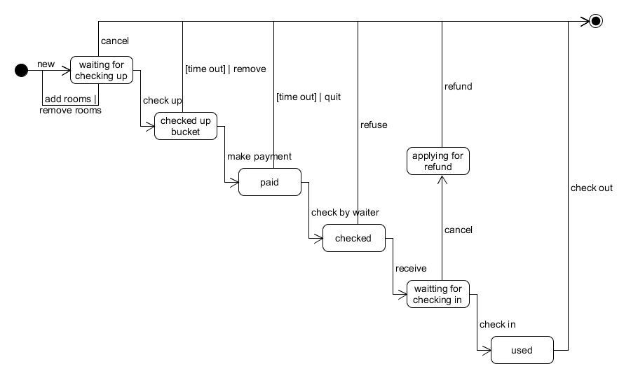
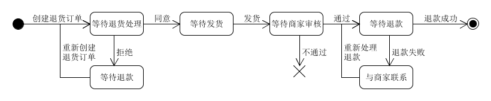

# 系统分析与设计 Assignment 6

> ⏰ 2018-05-04 20:44:41 
> 👨🏻‍💻 painterdrown

## 使用 UML State Model

建模对象： 参考 Asg_RH 文档， 对 Reservation/Order 对象建模。
建模要求： 参考练习不能提供足够信息帮助你对订单对象建模，请参考现在 定旅馆 的旅游网站，尽可能分析围绕订单发生的各种情况，直到订单通过销售事件（柜台销售）结束订单。

状态集合 S = { wating for check up, checked up, paid, granted, invoiced }。

事件集合 E = { new reservation, make changes, check the order, pay for the order, manager grant, invoice, user cancel, time out, manager cancel }。

## 研究天猫退货流程活动图，对退货业务对象状态建模

