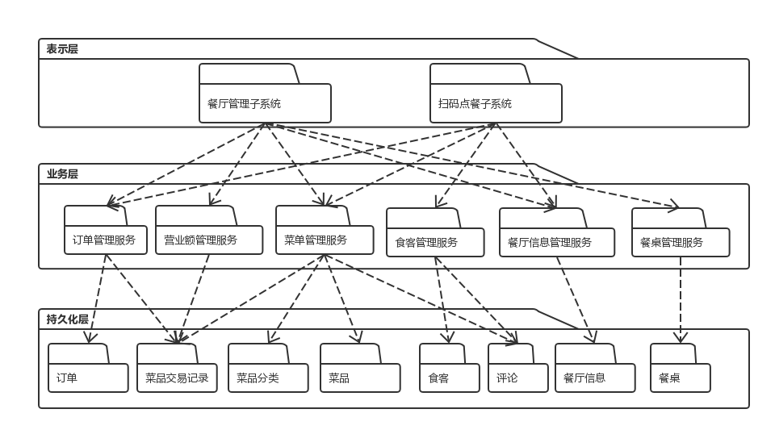

[painterdrown Blog](https://painterdrown.github.io) - [painterdrown SAAD](https://painterdrown.github.io/saad)

# SAAD Assignment 8 软件项目架构与框架

> ⏰ 2018-05-15 15:55:44 
> 👨🏻‍💻 painterdrown

## 1. 软件架构与框架之间的区别与联系

### 1.1. 概念解释

**架构 (Architecture)**。软件架构描述一个系统的组成元素，元素之间的接口，以及各个元素之间的协作行为，即软件系统的组织架构。

**架构模式 (Architecture Styles)**。软件架构模式是特定领域的组织解决方案，可以说是架构的特定风格，如信息系统领域的经典三层架构：表示层、业务层以及数据持久化层。

**应用框架 (Application Frameworks)**。框架是面向某领域（包括业务领域，如ERP，和计算领域，如GUI）的、可复用的“半成品”软件，它实现了该领域的共性部分，并提供一系列定义良好的可变点以保证灵活性和可扩展性。

### 1.2. 架构模式与框架的区别与联系

+ **区别**：框架是一种软件，是由特定语言实现，并应用于特定领域的软件。架构模式不是软件，架构模式是一种思想、风格，是一个抽象的概念。

+ **联系**：框架是架构模式的解决方案，架构模式是框架应用时的组织思想。

## 2. "中大零饭"架构模式

> 项目地址：https://github.com/dtosaad/documents

### 2.1. 绘制三层架构模型图，细致到分区

### 2.2. 结合你程序的结构，从程序员角度说明三层架构给开发者带来的便利

+ 每个层或包的职责是清晰的，模块化并可扩展的。系统分析的每个类会分明确的放置
+ 提供了隐式的程序复用准则
+ 每个层涉及的技术是明确的。这使得程序员可以通过快速培训上岗
+ 通过依赖估计项目变化产生的工作量
+ 开发次序和重要性是明确的。领域模型、基础模块（用户和基础数据的DTO和Service必须优先开发与测试），减少这些模块的错误，特别是领域模型设计失误，是项目成功的关键
+ 并行开发支持。利用前后端分离，实现并行开发

## 3. 研究 vue 与 flux 状态管理的异同

+ vue: vue 是一个构建数据驱动的 web 界面的渐进式框架。vuex 是专门为 vue 提供的状态管理工具。
+ flux: 状态集管理框架，由 facebook 创建，专门用来构建前端框架结构的框架。它分为四层：view 视图层、action 层、dispatcher 派发层、store 仓库层。
+ vue 与 flux 的联系: vue 的状态管理工具是 vuex，而 vuex 是 flux 的一个实现。
+ vue 与 flux 的区别: vue 是一个构建数据驱动的 web 界面的渐进式框架。 flux 是一种前端状态管理架构思想，专门解决软件的结构问题。
