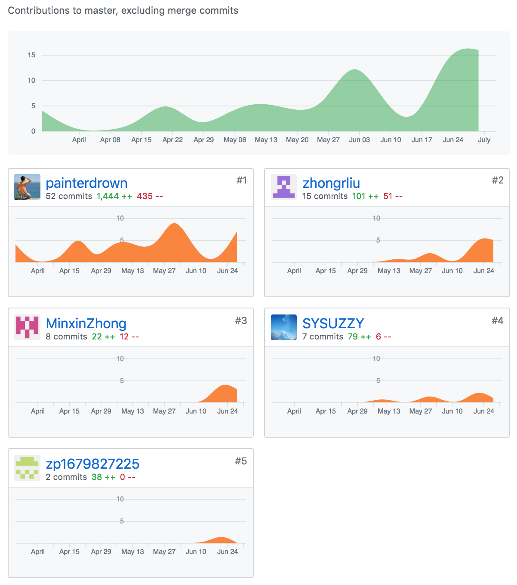
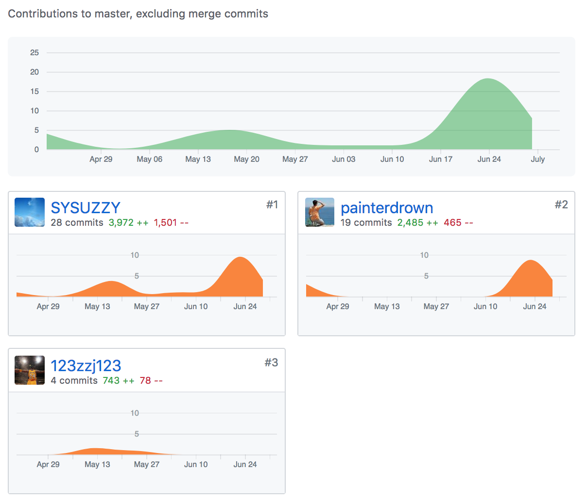
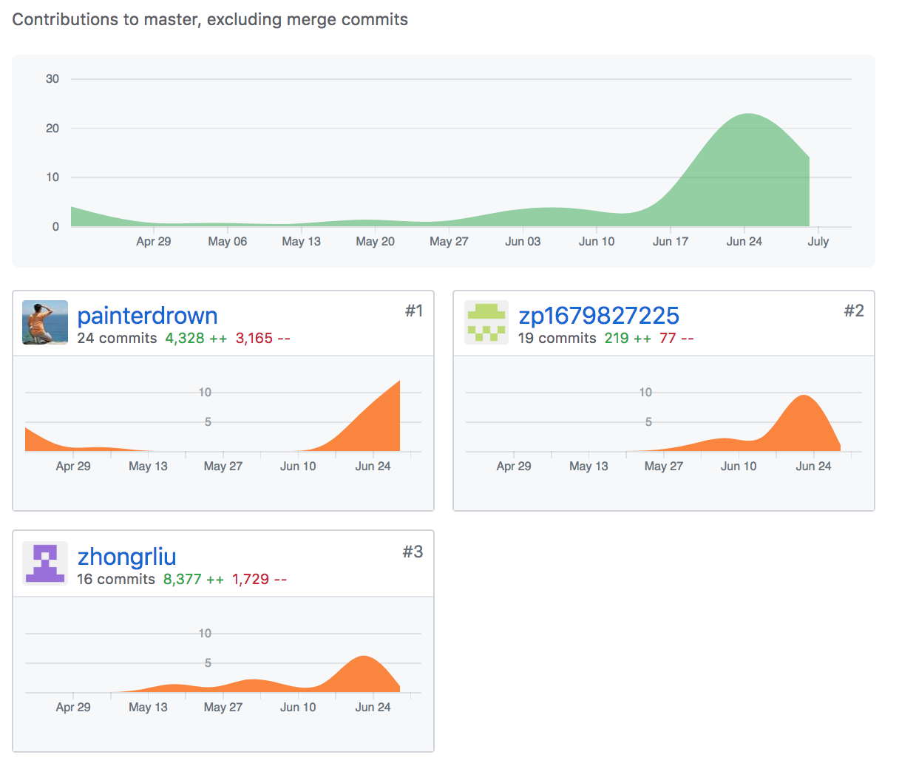
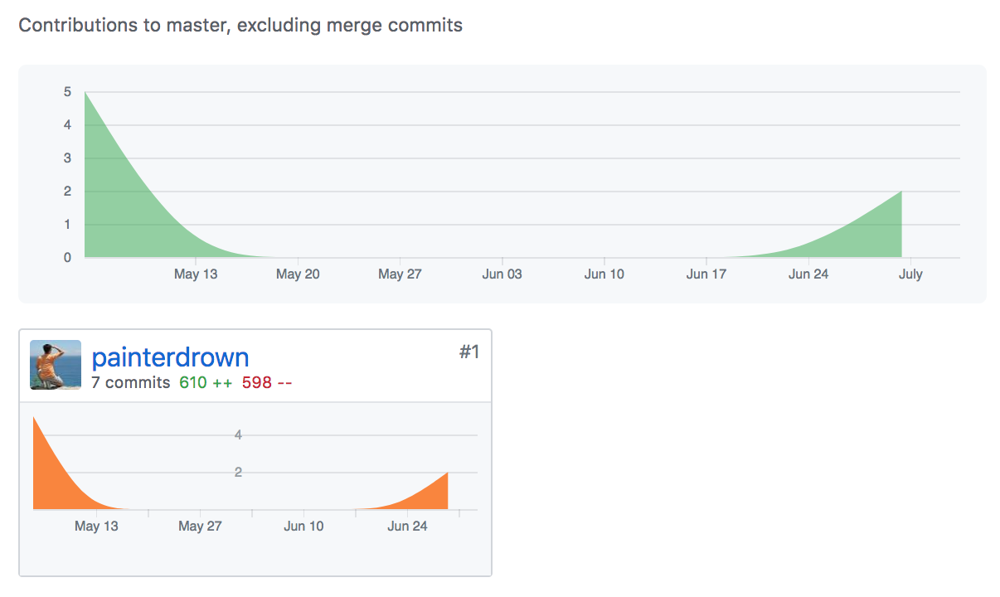

[painterdrown Blog](https://painterdrown.github.io) - [painterdrown SAAD](https://painterdrown.github.io/saad)

# SAAD Final Report

> ⏰ 2018-06-30 11:20:59 
> 👨🏻‍💻 painterdrown

## 1. 项目心得

在以往的很多软件工程中，我都是开发者的角色。在本次的《中大零饭》项目中，我破天荒地担任了产品经理一职，从三个月前项目的启动，到现在实现的期间，学习到了许多关于产品相关的知识，而这些知识对于开发者来说也是十分宝贵的。

首先，项目启动的时候，只给了`电影购票`以及`扫码点餐`两个话题，我们小组经第一次会议之后确定选择后者。当时这时候紧接着面临一个重大的问题就是：如何在这么多的扫码点餐之中脱颖而出？毕竟如果只做扫码点餐的话，与其他小组做的内容其实相差不大。所以必须在这基础之上做拓展，在保证扫码点餐的基础功能之上，拓展出至少一个具有创新性的功能。

作为产品经理，我们在思考这个问题的时候，我提出：先不考虑软件，而是现象现实生活中的点餐细节，考虑不同的餐厅类型，不同的用餐方式，然后思考如何用手机软件的形式来优化这些过程。于是，我们想到了一个场景：当多个人来到一家餐厅吃饭的时候，多人一起点餐的需求还是挺常见的。然而现实中的做法则是让服务员记下不同人点的菜品，如果出现重复则询问是否只保留一份。或者是多人在点餐的过程中说出自己点了什么菜品，将这个信息分享给同伴。将多人点餐这个场景通过手机软件来实现，确实是一个挺有创新性的功能。所以我们小组决定对这个功能进行用户调研、技术分析，最终认为这个功能可以实现并且可以很自然地与前面的扫码点餐融合在一起。

在功能的分析阶段，跟小伙伴的意见也是有很多的冲突，我们的解决方法便是：在考虑一个功能细节的取舍问题上，先让正方说明这个功能的必要性，然后反方说明其冗余性，然后前后端的开发者讨论其实现难度，三者综合考虑进行最终的取舍。这个流程也是小组其它成员都一致认同的，所以即使意见出现分歧，理性分析之后的结果也能让所有人心服。这也是我学到的很重要的一点心得。

## 2. PSP2.1 统计表

| PSP阶段  | 工作细节               | 耗时（H）|
| ------- | --------------------- | ------- |
| **计划** |                       | **10**  |
| **开发** |                       | **88**  |
|         | 分析需求                | 10      |
|         | 生成设计文档             | 5       |
|         | 设计复审                | 5       |
|         | 代码规范                | 5       |
|         | 具体设计                | 5       |
|         | 具体编码                | 24      |
|         | 代码复审                | 10      |
|         | 测试                   | 24      |
| **报告** |                       | **6**   |
|         | 测试报告                | 2       |
|         | 计算工作量              | 2       |
|         | 事后总结，提出过程改进计划 | 2       |
| **合计** |                       | **104** |

## 3. GitHub 贡献

### 3.1. [文档](https://github.com/dtosaad/documents)

负责大部分。

### 3.2. [前端](https://github.com/dtosaad/front-end)

负责小部分。

### 3.3. [后端](https://github.com/dtosaad/back-end)

负责小部分。

### 3.4. [GitHub Pages](https://github.com/dtosaad/dtosaad.github.io)

负责所有。

## 4. 工作清单

本次项目中我作为产品经理，主要贡献就是：
  1. 思考《中大零饭》的所有功能细节
  2. 组织小组进行开会
  3. 确定产品开发的迭代周期
  4. 负责大部分产品文档
  5. 演示视频的录制以及剪辑

另外，在项目的后期，由于队中有一个开发小伙伴要去实习，为了不影响打码进度，我在项目的后期也加入到了开发的队列中，做出的贡献有：
  1. 前端帮忙修改主要界面的部分代码
  2. 后端帮忙 debug 以及修改部分 API

BTW，附上我的博客列表：
  + [微信小程序环境搭建技术报告](https://github.com/dtosaad/documents/blob/master/tech_reports/15331424-wx_mini_program_env.md)
  + [软件架构文档](https://github.com/dtosaad/documents/blob/master/tech_reports/architecture.md)

## 5. 鸣谢

1. 感谢另外一位产品经理 ZMX，不但帮忙写了很多产品文档，也全权负责 UI，十分辛苦。
2. 感谢前端开发小哥哥 ZZY 和 ZZJ，特别是前者作为前端的绝对主力，后面也一起进行测试，很棒。
3. 感谢后端的 ZRL 和 ZP，前者作为后端的主力，帮了很多忙，感谢。
