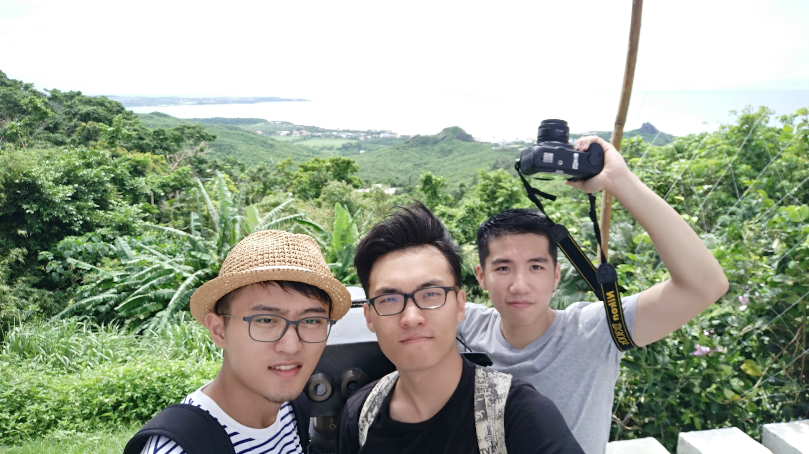

[painterdrown Blog](https://painterdrown.github.io) - [painterdrown Travel](https://painterdrown.github.io/travel)

# 台湾游第六天(27th)：20,000+ 步

> ⏰ 2017-08-27 
> 👨🏻‍💻 painterdrown

早晨⏰是8点，结果子扬👦先起来洗漱，然后又躺下去睡。狗哥🐶看到子扬没起来，也就没起来。我看到狗哥🐶没起来，也就…结果我们10点钟出的门，在附近吃了早餐之后呢，大概在11点半就出发，goto垦丁国家森林公园🌲。

为了省钱嘛，我们选择最粗暴的步行（5公里）！走了一半累得不行，幸好半途有家垦丁宾馆🏨（三星级，但是我觉得豪华得应该是五星）可以给我们坐一坐喝口水拉泡翔。继续往上爬，反正就走了很久很久。不过很安慰的一点就是，上山的公路很新很漂亮，沿途的草木也是好看，时不时还能看到垦丁的海滩～闲得无聊，我躺在大马路中间玩街拍，狗哥🐶很嫌弃，不过玩玩没有什么不好嘿嘿嘿😁

讲真，今天真没什么好玩的事情啊地方啊，就是逛了一个很平常的植物园咯。反正就走了很长很长的路（下山也是走路下来的！）。然后晚饭就在对面的小炒店解决啦，可能是太累太饿了就觉得挺好吃的（第一次尝到了鸵鸟肉😄）。

好啦，明天打算看👀海滩日出🌄的！应该要4点钟起来，现在快10点了，该睡啦晚安😴💤😘⭐️🌙！
